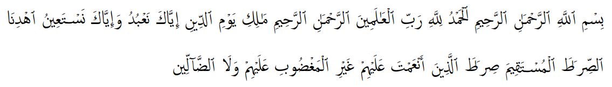
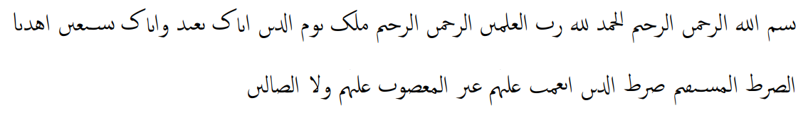

# Description

Reduce arabic text to its rasm, i.e. remove vocalization marks, diacritics so you only are left with a *basic consonant skeleton*.

For example, the first verse of the Qur'an as found on [corpuscoranicum.org](https://corpuscoranicum.org/en/verse-navigator/sura/1/verse/1/print):

Compare the following examples:

**Text with diacritics etc**


**Text without diacritics (rasmified)**


This is the updated version of the [package](https://github.com/telota/rasmify) published by Telota, and some of the code has been retained. Check out that repository for the [demo](https://telota.github.io/rasmify.js/demo/).


# Usage

To convert an arabic string to its *rasm*, use the following code:

```
use CCev\Rasmify;

$rasmified = Rasmify::rasmify($arabicString);
```

or run the the file `test.php`.